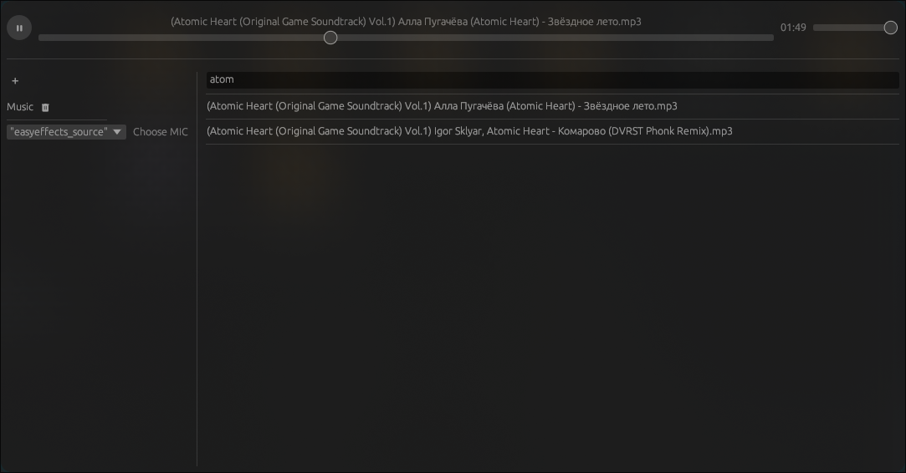

# PipeWire SoundPad

This is a simple soundpad application written in Rust using egui for the GUI, pipewire for audio input/output, and rodio for audio decoding. It allows you to play various audio files (mp3, wav, ogg, flac, mp4, aac) through your microphone.

## Features

*   **Audio File Playback:** Supports a wide range of audio formats including mp3, wav, ogg, flac, mp4, and aac.
*   **Microphone Output:** Plays selected audio files through the chosen microphone.
*   **PipeWire Integration:** Leverages PipeWire for efficient audio routing and device management.
*   **egui GUI:** Provides a user-friendly interface for file selection, playback control, and microphone selection.
*   **Directory Management:** Allows adding and removing directories for organizing audio files.
*   **Search Functionality:** Enables searching for specific audio files within loaded directories.
*   **Playback Control:** Offers play/pause functionality, volume control, and a playback position slider.
*   **Persistent Configuration:** Saves the list of added directories and the selected microphone for future use.

## Installation

1.  **Rust and Cargo:** Ensure you have Rust and Cargo installed. You can install them from [https://www.rust-lang.org/tools/install](https://www.rust-lang.org/tools/install).
2.  **Dependencies:** This project requires PipeWire to be installed on your system.  The specific installation steps will depend on your distribution.
3.  **Clone the Repository:** Clone this repository to your local machine.
4.  **Build:** Navigate to the project directory in your terminal and run `cargo build --release`.

## Usage

1.  **Run:** After building, run the application using `cargo run --release`.
2.  **Add Directories:** Click the "+" button to add directories containing your audio files.
3.  **Select Directory:** Click on a directory in the list to view its contents.
4.  **Select Audio File:** Click on an audio file in the list to select it.
5.  **Choose Microphone:** Select your desired microphone from the dropdown menu.
6.  **Play/Pause:** Use the play/pause button to control playback.
7.  **Volume:** Adjust the volume using the volume slider.
8.  **Seek:** Use the playback position slider to navigate through the audio file.
9.  **Search:** Use the search bar to filter audio files by name.

## Configuration

The application saves the list of added directories and the selected microphone in the application's configuration directory.  This directory is typically located at `~/.config/pwsp`.

## Contributing

Contributions are welcome! Please open an issue or submit a pull request.

## License

[MIT](LICENSE)