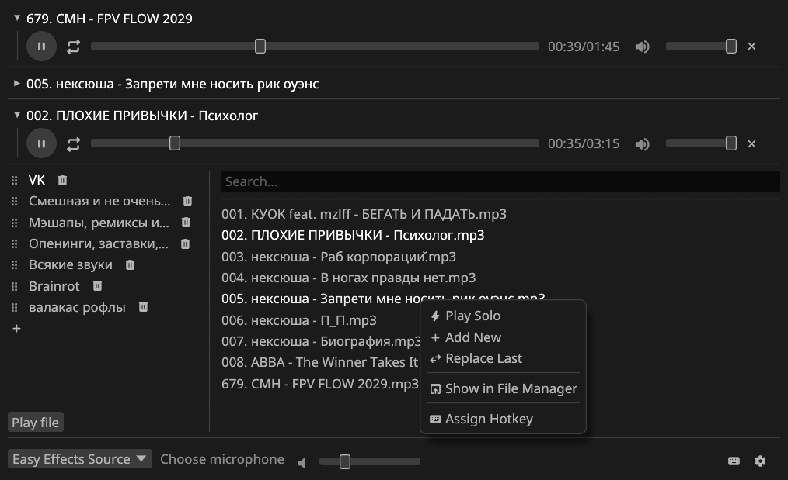

# PipeWire Soundpad (PWSP) 🎵



[🇷🇺 Читать на русском](README.ru.md) | [🇺🇸 Read in English](README.md)

[](https://github.com/arabianq/pipewire-soundpad/actions)
[](https://opensource.org/licenses/MIT)
[](https://github.com/arabianq/pipewire-soundpad/releases/latest)
[](https://pipewire.org/)

**PipeWire Soundpad (PWSP)** is a modern, low-latency application that lets you play audio files directly through your microphone. Designed specifically for Linux, it leverages the power of PipeWire to achieve native integration without the need for Pulseaudio bridges or complex virtual sinks.

---

## ✨ Features

- **Native PipeWire Integration:** Direct communication with the PipeWire API for the lowest possible latency.
- **Modular Architecture:** Consists of a background `daemon`, a command-line interface (`cli`), and a graphical user interface (`gui`).
- **Modern GUI:** Built with `egui`, supporting both Wayland and X11 seamlessly.
- **Global Hotkeys:** Powered by `evdev`, allowing you to play sounds from anywhere.
- **Broad Audio Support:** Powered by `rodio` and `symphonia` to support a wide range of audio formats.

---

## 🚀 Installation

We provide multiple ways to install PWSP, including stable releases and rolling "nightly" builds directly from the `main` branch.

### 📦 Flatpak (Recommended)

Add our official OSTree repository and install the application:

```bash
# Add the repository
flatpak remote-add --if-not-exists arabianq-repo https://arabianq.github.io/pipewire-soundpad/pwsp.flatpakrepo

# Install the Stable version
flatpak install arabianq-repo ru.arabianq.pwsp//stable

# OR Install the Nightly version (rolling updates)
flatpak install arabianq-repo ru.arabianq.pwsp//nightly
```

### 🟠 Debian / Ubuntu (APT Repository)

We maintain an official APT repository for seamless updates via `apt`:

```bash
# 1. Download the public GPG key
wget -O- https://arabianq.github.io/pipewire-soundpad/apt/pubkey.gpg | sudo gpg --dearmor -o /etc/apt/keyrings/pwsp.gpg

# 2. Add the repository (Choose STABLE or NIGHTLY)
# For Stable:
echo "deb [signed-by=/etc/apt/keyrings/pwsp.gpg] https://arabianq.github.io/pipewire-soundpad/apt/ stable main" | sudo tee /etc/apt/sources.list.d/pwsp.list

# For Nightly:
# echo "deb [signed-by=/etc/apt/keyrings/pwsp.gpg] https://arabianq.github.io/pipewire-soundpad/apt/ nightly main" | sudo tee /etc/apt/sources.list.d/pwsp.list

# 3. Update and install
sudo apt update
sudo apt install pwsp-gui
```

### 🐧 Fedora / RHEL (COPR)

Available via the Fedora COPR repository:

```bash
sudo dnf copr enable arabianq/pwsp
sudo dnf install pwsp
```

### ⚙️ Manual / Standalone

You can manually download `.deb` packages or standalone `.zip` binaries from the [Releases page](https://github.com/arabianq/pipewire-soundpad/releases).

### 🦀 Build from Source

Make sure you have Rust, Cargo, and the required dependencies (`libpipewire-0.3-dev`, `libclang-dev`, `libasound2-dev`, `libdbus-1-dev`) installed.

```bash
git clone https://github.com/arabianq/pipewire-soundpad.git
cd pipewire-soundpad
cargo build --release --locked
```

The binaries will be located in `target/release/`.

---

## 🎮 Usage

### 1. Start the Daemon

PWSP operates via a background daemon that handles the audio routing.

```bash
# Run the daemon
pwsp-daemon
```

_(Tip: If installed via package managers, a systemd user service is provided. You can enable it with `systemctl --user enable --now pwsp-daemon.service`)_

### 2. Launch the GUI

Simply run the graphical interface to manage and play your sounds:

```bash
pwsp-gui
```

### 3. Use the CLI

You can also interact with the daemon directly via the command line:

```bash
pwsp-cli play /path/to/sound.mp3
pwsp-cli stop
pwsp-cli status
```

---

## 📚 Documentation & DeepWiki

For advanced configuration, troubleshooting, architecture details, and custom setups, please visit our official Wiki:

[](https://deepwiki.com/arabianq/pipewire-soundpad)

---

## 🤝 Contributing

Contributions, issues, and feature requests are welcome!

1. Fork the project.
2. Create your feature branch (`git checkout -b feat/amazing-feature`).
3. Commit your changes (`git commit -m 'Add some amazing feature'`).
4. Push to the branch (`git push origin feat/amazing-feature`).
5. Open a Pull Request.

---

## 📝 License

Distributed under the MIT License. See `LICENSE` for more information.

_Built with ❤️ for the Linux community._
