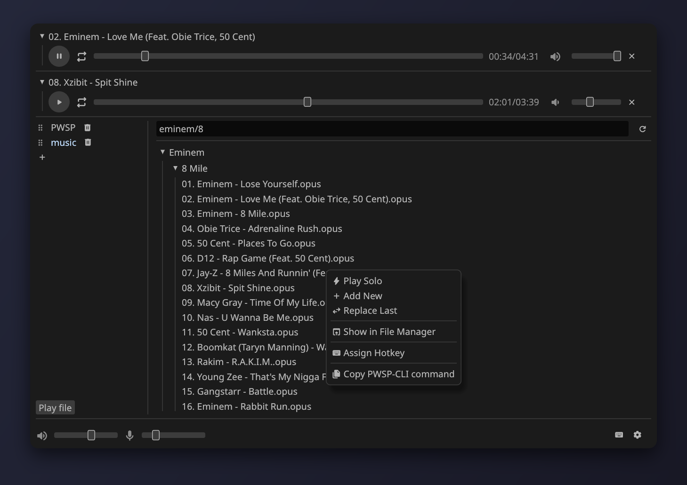
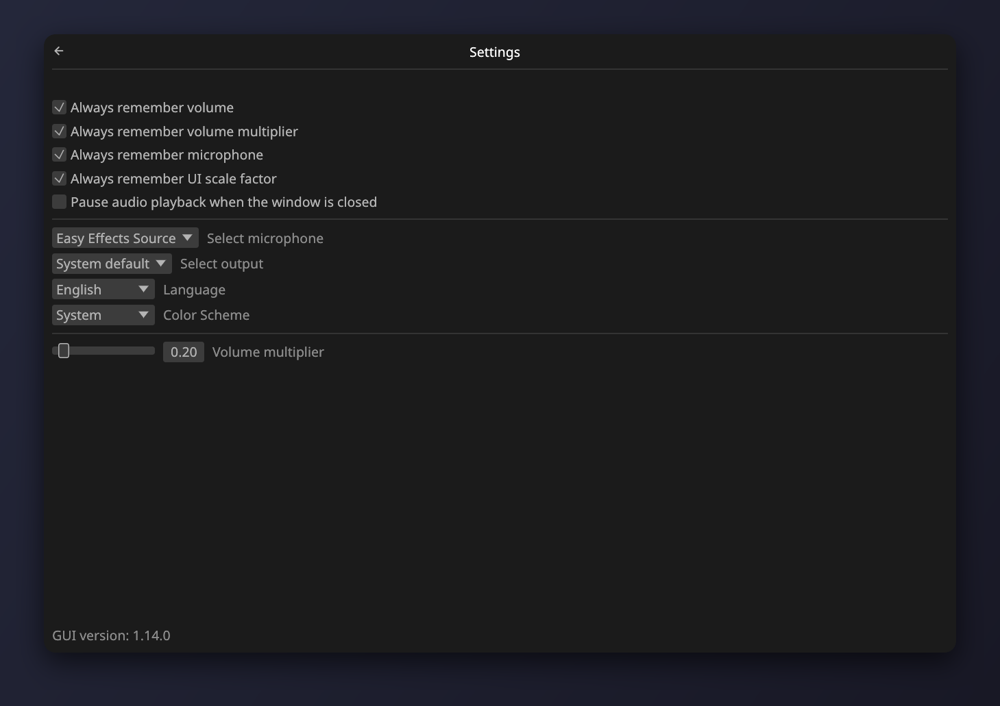
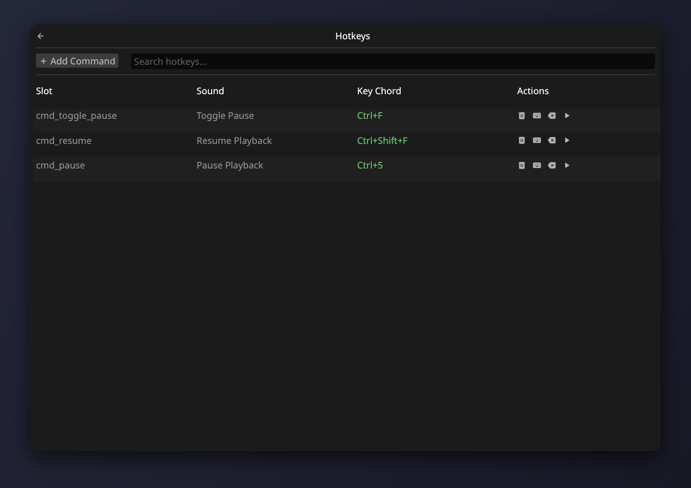

# PipeWire Soundpad (PWSP) 🎵

<table border="0">
  <tr>
    <td colspan="2" align="center">
      <h3>Main Screen</h3>
      
    </td>
  </tr>
  <tr>
    <td width="50%" align="center">
      <h3>Settings</h3>
      
    </td>
    <td width="50%" align="center">
      <h3>Hotkeys</h3>
      
    </td>
  </tr>
</table>

[🇷🇺 Читать на русском](README.ru.md) | 🇬🇧 English (you are here)

[](https://github.com/arabianq/pipewire-soundpad/actions)
[](https://opensource.org/licenses/MIT)
[](https://github.com/arabianq/pipewire-soundpad/releases/latest)
[](https://pipewire.org/)

**PipeWire Soundpad (PWSP)** is a modern application that lets you play audio files directly through your microphone. Designed specifically for Linux, it talks to PipeWire natively: it creates its own virtual microphone and wires everything up itself, so you never have to build a routing setup by hand.

---

## ✨ Features

- **Native PipeWire Integration:** PWSP creates its own virtual microphone and manages the graph through the PipeWire API — no manual `pw-link` juggling, no PulseAudio modules to load.
- **Separate Monitoring and Microphone Volumes:** Two independent streams, so you can amplify what your friends hear without deafening yourself, and pick which device the monitoring plays on.
- **Modular Architecture:** Consists of a background `daemon`, a command-line interface (`cli`), and a graphical user interface (`gui`).
- **Modern GUI:** Built with `egui`, supporting both Wayland and X11 seamlessly.
- **Localized:** Ships in 9 languages, following your system locale or one you pick yourself in the settings.
- **Global Hotkeys:** Powered by `evdev`, allowing you to play sounds from anywhere.
- **Broad Audio Support:** Powered by `rodio` and `symphonia` to support a wide range of audio formats, including Opus.

---

## 🚀 Installation

We provide multiple ways to install PWSP, including stable releases and rolling "nightly" builds directly from the `main` branch.

### 📦 Flatpak (Recommended)

Add our official OSTree repository and install the application:

```bash
# Add the repository
flatpak remote-add --if-not-exists pwsp https://arabianq.github.io/pipewire-soundpad/pwsp.flatpakrepo

# Install the Stable version
flatpak install pwsp ru.arabianq.pwsp//stable

# OR Install the Nightly version (rolling updates)
flatpak install pwsp ru.arabianq.pwsp//nightly
```

### 🟠 Debian / Ubuntu (APT Repository)

We maintain an official APT repository for seamless updates via `apt`:

```bash
# 1. Download the public GPG key
sudo mkdir -p /etc/apt/keyrings
wget -O- https://arabianq.github.io/pipewire-soundpad/apt/pubkey.gpg | sudo gpg --dearmor -o /etc/apt/keyrings/pwsp.gpg

# 2. Add the repository (Choose STABLE or NIGHTLY)
# For Stable:
echo "deb [signed-by=/etc/apt/keyrings/pwsp.gpg] https://arabianq.github.io/pipewire-soundpad/apt/ stable main" | sudo tee /etc/apt/sources.list.d/pwsp.list

# For Nightly:
# echo "deb [signed-by=/etc/apt/keyrings/pwsp.gpg] https://arabianq.github.io/pipewire-soundpad/apt/ nightly main" | sudo tee /etc/apt/sources.list.d/pwsp.list

# 3. Update and install
sudo apt update
sudo apt install pwsp
```

### 🐧 Fedora / RHEL (COPR)

Available via the Fedora COPR repository:

```bash
sudo dnf copr enable arabianq/pwsp
sudo dnf install pwsp
```

### 🐦 Arch Linux (AUR)

Two packages are available: `pwsp` builds from source, `pwsp-bin` installs the prebuilt binaries.

```bash
# Using your preferred AUR helper
paru -S pwsp      # or: pwsp-bin
```

### ⚙️ Manual / Standalone

You can manually download `.deb` packages or standalone `.zip` binaries from the [Releases page](https://github.com/arabianq/pipewire-soundpad/releases).

### 🦀 Build from Source

Make sure you have **Rust 1.85+** and Cargo installed, along with the build dependencies. On Debian/Ubuntu:

```bash
sudo apt install libpipewire-0.3-dev libclang-dev libasound2-dev libdbus-1-dev libssl-dev pkg-config
```

```bash
git clone https://github.com/arabianq/pipewire-soundpad.git
cd pipewire-soundpad
cargo build --release --locked
```

The binaries will be located in `target/release/`.

---

## 🎮 Usage

### 1. Start the Daemon

PWSP operates via a background daemon that handles the audio routing.

```bash
# Run the daemon
pwsp-daemon
```

_(Tip: If installed via package managers, a systemd user service is provided. You can enable it with `systemctl --user enable --now pwsp-daemon.service`)_

### 2. Launch the GUI

Simply run the graphical interface to manage and play your sounds:

```bash
pwsp-gui
```

### 3. Use the CLI

You can also interact with the daemon directly via the command line. Every command is grouped under `action`, `get` or `set`:

```bash
pwsp-cli action play /path/to/sound.mp3
pwsp-cli action stop
pwsp-cli get state

# Separate volumes for what you hear and what is sent to the microphone.
# Values above 1.0 amplify.
pwsp-cli set monitoring-volume 0.3
pwsp-cli set mic-volume 1.5

# Devices
pwsp-cli get inputs
pwsp-cli set input <name>
```

Run `pwsp-cli <group> --help` for the full list.

### 🔑 Enabling Global Hotkeys

Hotkeys are read straight from the kernel via `evdev`, which means the daemon needs access to `/dev/input/event*`. On most distributions that means adding yourself to the `input` group:

```bash
sudo usermod -aG input $USER
```

Log out and back in for it to take effect. Without this, everything else works — only the global hotkeys stay silent.

### 📦 A Note for Flatpak Users

The Flatpak ships a single entry point, so the commands above are reached through `flatpak run`:

```bash
# No arguments: starts the daemon and the GUI together
flatpak run ru.arabianq.pwsp

# The daemon on its own
flatpak run ru.arabianq.pwsp daemon --start
flatpak run ru.arabianq.pwsp daemon --kill

# Anything after "cli" is passed to pwsp-cli
flatpak run ru.arabianq.pwsp cli action play /path/to/sound.mp3
```

---

## 📚 Documentation & DeepWiki

DeepWiki generates a browsable overview of the architecture from the source, and lets you ask questions about it. It is generated automatically rather than written by hand, so treat it as a map, not as a specification:

[](https://deepwiki.com/arabianq/pipewire-soundpad)

---

## 🤝 Contributing

Contributions, issues, and feature requests are welcome!

1. Fork the project.
2. Create your feature branch (`git checkout -b feat/amazing-feature`).
3. Commit your changes (`git commit -m 'Add some amazing feature'`).
4. Push to the branch (`git push origin feat/amazing-feature`).
5. Open a Pull Request.

---

## 📝 License

Distributed under the MIT License. See `LICENSE` for more information.

_Built with ❤️ for the Linux community._
